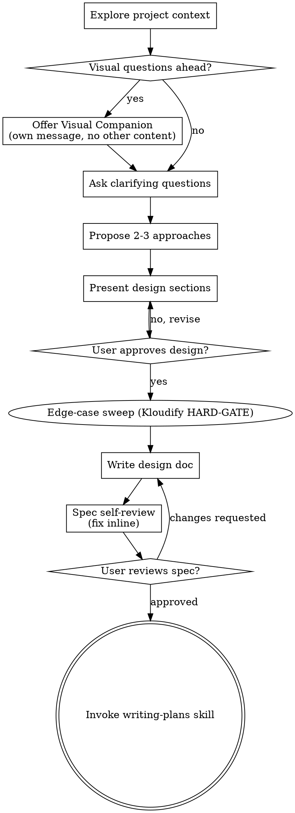

# Brainstorming Ideas Into Designs

Help turn ideas into fully formed designs and specs through natural collaborative dialogue.

Start by understanding the current project context, then ask questions one at a time to refine the idea. Once you understand what you're building, present the design and get user approval.

<HARD-GATE>
Do NOT invoke any implementation skill, write any code, scaffold any project, or take any implementation action until you have presented a design and the user has approved it. This applies to EVERY project regardless of perceived simplicity.

In Kloudify-flavored projects (those with `.claude/kloudify/`): do NOT write the spec doc until the edge-case sweep table is populated per step 6. The HARD-GATE in step 6 is downstream of this one — design approval first, edge-case sweep second, spec doc third.
</HARD-GATE>

<KLOUDIFY-AUTO-CONFIRM>
In Kloudify-flavored projects (those with `.claude/kloudify/`), this skill operates in **auto-confirm mode**:

- **Steps 1-4 remain user-gated** as designed: explore, visual offer, clarifying questions, propose approaches. The user provides input; the AI does NOT auto-confirm these.
- **Steps 5-10 run unattended** with **self-review specs imposed per-step** where a user gate previously existed. Each step has its own pass/fail criteria below — these are NOT a generic "looks ok?" rubric. If a step fails its self-review, the AI fixes inline and re-runs the criterion before proceeding; if the same step fails self-review twice in a row, the AI surfaces the issue to the user and waits.

**Per-step self-review specs** (apply in auto-confirm mode only):

**Step 5 — Present design (per-section self-review)**
After drafting each design section, before outputting it to chat, the AI checks:
1. *Concreteness*: does the section name actual files, modules, or call paths in this codebase? (Generic "use the auth middleware" without naming the file → fail.)
2. *Decision visibility*: are the trade-offs the AI implicitly resolved while writing this section called out? (E.g. "we keep the existing X interface" — say so explicitly so a reader sees what was chosen.)
3. *Coupling-claim grounding*: any "Y depends on X" / "this won't break Z" assertion must reference either the actual code or the spec, not an internal model assumption. If the AI cannot back the claim with a code anchor, soften the claim (`"likely depends on"` + open question for user) or drop it.
4. *Length appropriateness*: a section longer than 300 words on a small problem is a self-review failure — split or compress.

When all 4 pass, output the section and proceed to the next. Do NOT ask "looks right?".

**Step 6 — Edge-case sweep self-review**
After producing the 12-row edge-case table, before proceeding, the AI checks:
1. *No empty buckets*: every one of the 12 categories has at least one row. A bucket marked "n/a" without a justification is a fail; rewrite as `"none — <input class is constrained by X>"` and verify X is real.
2. *Status distribution sanity*: if more than 60% of rows are `out-of-scope`, the AI is shrinking the problem rather than enumerating it — re-walk the buckets and look harder. (Empirical anti-pattern: a single "out-of-scope: future work" row blanket-applied across 8 buckets.)
3. *No unbacked `already-covered`*: every `already-covered` row must name the layer that covers it (e.g. *"already-covered by FastAPI rate-limit middleware in routes/auth.py"*). A bare `already-covered` with no anchor is a fail.
4. *No silent `non-bug`*: every `non-bug` row needs a one-line *why* — "this is by design because X". Without the why, downgrade to `out-of-scope` with a documented trigger to revisit.

**Step 7 — Write design doc (post-write check)**
After saving and committing the spec, the AI verifies:
1. The committed file path exists at `docs/superpowers/specs/YYYY-MM-DD-<topic>-design.md` (or the project-overridden path).
2. The commit's diff contains the spec content (`git show HEAD --stat` shows the new file with non-zero insertions).
3. The spec contains a `## Edge cases triaged` section with the table from step 6 verbatim.
4. The spec is under 400 lines (Kloudify Document Authoring Discipline rule). If over, split into spec + appendix and re-commit.

If any check fails, fix and re-commit before step 8.

**Step 8 — Spec self-review (the existing 4-check inline scan)**
This step is already a self-review by design (placeholder scan, internal consistency, scope check, ambiguity check). In auto-confirm mode the AI runs it inline as documented and proceeds when issues are fixed; **adds one extra check**:
5. *Reachability*: does anything in the spec reference a file/function/flag that the AI has not actually verified exists? If yes, either verify (read the file / grep) or rewrite to remove the reference. Spec must not depend on phantom code.

**Step 9 — Spec proceed-or-interrupt announcement (replaces user review gate)**
The AI emits one chat message in this exact shape:

> *"Spec at `<path>` (commit `<sha>`, <N> lines, <K> edge cases triaged). Proceeding to writing-plans in this turn. Interrupt now if you want to review."*

The AI then **immediately** in the same turn invokes `writing-plans` — it does NOT wait for a reply. The user can stop the next turn by typing while the AI is still in writing-plans, but there is no synchronous gate.

**Step 10 — Transition to writing-plans**
No self-review needed. Just invoke `writing-plans`. The plan-authoring skill has its own auto-confirm spec.

**Cross-cutting interrupt protocol**: at any point during steps 5-10, if the user types a message in chat, the AI MUST treat it as a potential override. Read the message before continuing the next step. The user's right to interrupt is not negotiable — auto-confirm means "no synchronous gate", not "ignore user input".

The user retains the right to interrupt at any moment. The default after step 4 is **proceed**, not **wait**. This is a deliberate inversion of the upstream "incremental validation" principle — Kloudify users have already chosen the approach in step 4 and want the rest to flow.

This mode does NOT apply outside Kloudify projects (no `.claude/kloudify/` present). Detection: `[ -d .claude/kloudify ]`. The check fires once at skill start, not per-step.
</KLOUDIFY-AUTO-CONFIRM>

## Anti-Pattern: "This Is Too Simple To Need A Design"

Every project goes through this process. A todo list, a single-function utility, a config change — all of them. "Simple" projects are where unexamined assumptions cause the most wasted work. The design can be short (a few sentences for truly simple projects), but you MUST present it and get approval.

## Checklist

You MUST create a task for each of these items and complete them in order:

1. **Explore project context** — check files, docs, recent commits
2. **Offer visual companion** (if topic will involve visual questions) — this is its own message, not combined with a clarifying question. See the Visual Companion section below.
3. **Ask clarifying questions** — one at a time, understand purpose/constraints/success criteria
4. **Propose 2-3 approaches** — with trade-offs and your recommendation
5. **Present design** — in sections scaled to their complexity. Get user approval after each section *outside* Kloudify projects. *In Kloudify projects (auto-confirm mode):* output each section to chat for visibility, then proceed to the next without pausing — apply the per-section self-review checklist (concreteness / decision visibility / coupling-claim grounding / length) defined in the KLOUDIFY-AUTO-CONFIRM block above.
6. **Edge-case sweep** (Kloudify HARD-GATE — only fires in projects with `.claude/kloudify/`) — for every Kloudify-flavored project, the design is not complete until you have produced an explicit edge-case enumeration. Walk the 12-category Kloudify taxonomy (see `.claude/kloudify/universal-rules.md` "Edge-case enumeration is MANDATORY" section, or the canonical taxonomy table at https://github.com/GravyaDev/Kloudify/blob/main/universal-rules.md) and for each category record at least one row in the format `| # | Scenario | Failure mode | Mitigation | Status |`. Status MUST be one of: `implemented` / `out-of-scope` / `already-covered` / `non-bug`. Empty buckets are NOT acceptable — write `none — input is constrained by <x>` so the reader sees the bucket was considered. The 12 categories: external-dependency failure, abuse/rate-limit vector, sibling-actor variants, sibling-flow contamination, malformed/boundary input, race/concurrency, partial failure/atomicity, transient/retryable error, tenant/scope leakage, state invariant violation, empty/cold-start, time/timezone. The spec doc you write in step 7 MUST contain a `## Edge cases triaged` section with the populated table. Skipping this step or writing the spec without the table is a HARD-GATE violation in the same class as skipping a `MANDATORY` step. *Why*: empirical 2026-05-01 — a clean 30-line auth-middleware fix shipped covering only 1 of 9 actual edge cases. User intervention forced enumeration; three of the missed cases were load-bearing in production. The cost of the table is minutes; the cost of a missed edge case is hours of triage.
7. **Write design doc** — save to `docs/superpowers/specs/YYYY-MM-DD-<topic>-design.md` and commit
8. **Spec self-review** — quick inline check for placeholders, contradictions, ambiguity, scope (see below)
9. **User reviews written spec** — ask user to review the spec file before proceeding. *In Kloudify projects (auto-confirm mode):* DO NOT pause for review. Announce *"Spec at `<path>` (commit `<sha>`), proceeding to writing-plans. Interrupt now if you want to review."* and proceed immediately to step 10.
10. **Transition to implementation** — invoke writing-plans skill to create implementation plan

## Process Flow

**The terminal state is invoking writing-plans.** Do NOT invoke frontend-design, mcp-builder, or any other implementation skill. The ONLY skill you invoke after brainstorming is writing-plans.

## The Process

**Understanding the idea:**

- Check out the current project state first (files, docs, recent commits)
- Before asking detailed questions, assess scope: if the request describes multiple independent subsystems (e.g., "build a platform with chat, file storage, billing, and analytics"), flag this immediately. Don't spend questions refining details of a project that needs to be decomposed first.
- If the project is too large for a single spec, help the user decompose into sub-projects: what are the independent pieces, how do they relate, what order should they be built? Then brainstorm the first sub-project through the normal design flow. Each sub-project gets its own spec → plan → implementation cycle.
- For appropriately-scoped projects, ask questions one at a time to refine the idea
- Prefer multiple choice questions when possible, but open-ended is fine too
- Only one question per message - if a topic needs more exploration, break it into multiple questions
- Focus on understanding: purpose, constraints, success criteria

**Exploring approaches:**

- Propose 2-3 different approaches with trade-offs
- Present options conversationally with your recommendation and reasoning
- Lead with your recommended option and explain why

**Presenting the design:**

- Once you believe you understand what you're building, present the design
- Scale each section to its complexity: a few sentences if straightforward, up to 200-300 words if nuanced
- Ask after each section whether it looks right so far
- Cover: architecture, components, data flow, error handling, testing
- Be ready to go back and clarify if something doesn't make sense

**Design for isolation and clarity:**

- Break the system into smaller units that each have one clear purpose, communicate through well-defined interfaces, and can be understood and tested independently
- For each unit, you should be able to answer: what does it do, how do you use it, and what does it depend on?
- Can someone understand what a unit does without reading its internals? Can you change the internals without breaking consumers? If not, the boundaries need work.
- Smaller, well-bounded units are also easier for you to work with - you reason better about code you can hold in context at once, and your edits are more reliable when files are focused. When a file grows large, that's often a signal that it's doing too much.

**Working in existing codebases:**

- Explore the current structure before proposing changes. Follow existing patterns.
- Where existing code has problems that affect the work (e.g., a file that's grown too large, unclear boundaries, tangled responsibilities), include targeted improvements as part of the design - the way a good developer improves code they're working in.
- Don't propose unrelated refactoring. Stay focused on what serves the current goal.

## After the Design

**Documentation:**

- Write the validated design (spec) to `docs/superpowers/specs/YYYY-MM-DD-<topic>-design.md`
  - (User preferences for spec location override this default)
- Use elements-of-style:writing-clearly-and-concisely skill if available
- Commit the design document to git

**Spec Self-Review:**
After writing the spec document, look at it with fresh eyes:

1. **Placeholder scan:** Any "TBD", "TODO", incomplete sections, or vague requirements? Fix them.
2. **Internal consistency:** Do any sections contradict each other? Does the architecture match the feature descriptions?
3. **Scope check:** Is this focused enough for a single implementation plan, or does it need decomposition?
4. **Ambiguity check:** Could any requirement be interpreted two different ways? If so, pick one and make it explicit.

Fix any issues inline. No need to re-review — just fix and move on.

**User Review Gate:**

*Outside Kloudify projects:* After the spec review loop passes, ask the user to review the written spec before proceeding:

> "Spec written and committed to `<path>`. Please review it and let me know if you want to make any changes before we start writing out the implementation plan."

Wait for the user's response. If they request changes, make them and re-run the spec review loop. Only proceed once the user approves.

*In Kloudify projects (auto-confirm mode):* DO NOT wait. Announce in chat:

> "Spec at `<path>` (commit `<sha>`), proceeding to writing-plans. Interrupt now if you want to review."

Then immediately invoke `writing-plans`. The user can interrupt if they need to; the default is to proceed. This is the deliberate inversion described in the KLOUDIFY-AUTO-CONFIRM block at the top of this file — do not gate, but do remain interruptible.

**Implementation:**

- Invoke the writing-plans skill to create a detailed implementation plan
- Do NOT invoke any other skill. writing-plans is the next step.

## Key Principles

- **One question at a time** - Don't overwhelm with multiple questions
- **Multiple choice preferred** - Easier to answer than open-ended when possible
- **YAGNI ruthlessly** - Remove unnecessary features from all designs
- **Explore alternatives** - Always propose 2-3 approaches before settling
- **Incremental validation** - Present design, get approval before moving on
- **Be flexible** - Go back and clarify when something doesn't make sense

## Visual Companion

A browser-based companion for showing mockups, diagrams, and visual options during brainstorming. Available as a tool — not a mode. Accepting the companion means it's available for questions that benefit from visual treatment; it does NOT mean every question goes through the browser.

**Offering the companion:** When you anticipate that upcoming questions will involve visual content (mockups, layouts, diagrams), offer it once for consent:
> "Some of what we're working on might be easier to explain if I can show it to you in a web browser. I can put together mockups, diagrams, comparisons, and other visuals as we go. This feature is still new and can be token-intensive. Want to try it? (Requires opening a local URL)"

**This offer MUST be its own message.** Do not combine it with clarifying questions, context summaries, or any other content. The message should contain ONLY the offer above and nothing else. Wait for the user's response before continuing. If they decline, proceed with text-only brainstorming.

**Per-question decision:** Even after the user accepts, decide FOR EACH QUESTION whether to use the browser or the terminal. The test: **would the user understand this better by seeing it than reading it?**

- **Use the browser** for content that IS visual — mockups, wireframes, layout comparisons, architecture diagrams, side-by-side visual designs
- **Use the terminal** for content that is text — requirements questions, conceptual choices, tradeoff lists, A/B/C/D text options, scope decisions

A question about a UI topic is not automatically a visual question. "What does personality mean in this context?" is a conceptual question — use the terminal. "Which wizard layout works better?" is a visual question — use the browser.

If they agree to the companion, read the detailed guide before proceeding:
`skills/brainstorming/visual-companion.md`
